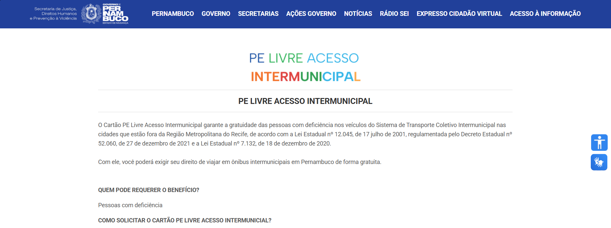

# ♿ PE Livre Acesso Intermunicipal


Projeto de interface web para a solicitação e consulta do cartão "PE Livre Acesso Intermunicipal", um benefício do Governo de Pernambuco destinado a garantir a gratuidade no transporte coletivo intermunicipal para pessoas com deficiência.

A aplicação foi desenvolvida com foco total em acessibilidade, usabilidade e responsividade, garantindo que todos os cidadãos possam interagir com a plataforma de forma simples e eficiente.

---

### 📖 Índice

- [📌 Sobre o Projeto](#-sobre-o-projeto)
- [💻 Tecnologias Utilizadas](#-tecnologias-utilizadas)
- [📂 Estrutura de Pastas](#-estrutura-de-pastas)
- [🎨 Figma](#-figma)
- [🖼️ Imagem do Projeto](#-imagem-do-projeto)

---

### 📌 Sobre o Projeto

O objetivo principal desta aplicação é modernizar e facilitar o processo de solicitação do benefício PE Livre Acesso. A interface é dividida em duas seções principais:

1.  **Página Informativa (`index.html`):** Uma landing page que detalha o que é o benefício, quem tem direito, quais documentos são necessários e como proceder para solicitar a passagem.
2.  **Formulário de Cadastro (`forms.html`):** Uma página com um formulário multi-etapas, intuitivo e com validação em tempo real, onde o usuário pode preencher seus dados e fazer o upload dos documentos necessários.

#### Funcionalidades Implementadas:

- **Design Responsivo:** A interface se adapta perfeitamente a dispositivos móveis, tablets e desktops.
- **Validação de Formulário:** Feedback visual imediato para o usuário em caso de campos obrigatórios não preenchidos.
- **Consulta de Endereço via CEP:** Integração com a API ViaCEP para preenchimento automático de endereço.
- **Recursos Avançados de Acessibilidade:**
  - **VLibras:** Widget integrado para tradução de conteúdo para a Língua Brasileira de Sinais.
  - **Alto Contraste:** Modo claro e escuro para melhorar a legibilidade.
  - **Ajuste de Fonte:** Controles para aumentar e diminuir o tamanho do texto.
  - **Semântica e `alt` text:** Uso correto de tags HTML e textos alternativos em todas as imagens para compatibilidade com leitores de tela.

---

### 💻 Tecnologias Utilizadas

Este projeto foi construído utilizando as seguintes tecnologias e ferramentas:

- **Front-end:**
  - `HTML5`
  - `CSS3`
  - `JavaScript` (Vanilla)

- **Bibliotecas e Frameworks:**
  - `Bootstrap 5`: Para a estrutura e componentes do formulário.
  - `jQuery` e `jQuery Mask Plugin`: Para a aplicação de máscaras nos campos de CPF, telefone e CEP.
  - `Cropper.js`: para corte inteligentes de imagens.

- **Acessibilidade:**
  - `Widget VLibras`: Ferramenta oficial do Governo Federal para tradução em Libras.
  - `Widget de Auto-Contraste`: Feito no próprio Js
  - `Widget de Aumento e diminuição de fonte`: Feito no próprio Js

- **Ambiente de Desenvolvimento:**
  - `Docker` e `Docker Compose`: Para garantir a portabilidade e facilitar a execução do ambiente de desenvolvimento.
  - `Visual Studio Code`: Para o desenvolvimento do sistema

---

### 📂 Estrutura de Pastas

O projeto está organizado da seguinte forma para facilitar a manutenção e escalabilidade:

```
INTERMUNICIPAL/
│
├── .idea/              # Pasta de configuração da IDE (pode ser ignorada)
├── site/               # Raiz do conteúdo web
│   ├── docs/
│   │   ├── DECRETO-No-52.060...pdf
│   │   └── Laudo_medico_padrao...pdf
│   │
│   ├── images/         # Ícones, logos e outras imagens
│   │   ├── iconacessibilidade.png
│   │   ├── iconaltocontraste.png
│   │   └── ...
│   │
│   ├── forms.css       # Estilos específicos da página de formulário
│   ├── forms.html      # Página do formulário de cadastro
│   ├── forms.js        # Scripts da página de formulário
│   ├── global.css      # (Opcional) Estilos globais para todas as páginas
│   ├── index.html      # Página inicial/informativa
│   ├── script.js       # Scripts da página inicial
│   └── style.css       # Estilos da página inicial
│
├── docker-compose.yml  # Arquivo de orquestração do Docker
└── Dockerfile          # Arquivo para construção da imagem Docker
```

---

### 🎨 Figma

O design do projeto e o protótipo de interface foram desenvolvidos no Figma e podem ser acessados através do link abaixo:

[Figma](https://www.figma.com/design/P49jEZJYNC7liAEfEm8fpd/SISTEMAS-SJDHPV?node-id=14-5&t=HGv3eGttDJieoxoD-1)

---

### 🖼️ Imagem do Projeto


